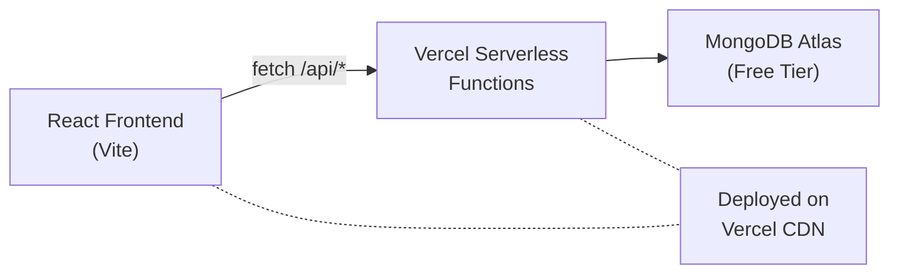

# Jira-Like Student Task Manager — A to Z Implementation Plan

A simple, clean task management system for students in your organization, inspired by Jira/Trello. Students can view and manage assigned tasks; Admins/Lecturers can create and assign tasks.

## Architecture Overview



**Why this architecture?**
- **Single deployment** — Both frontend and API deploy together on Vercel (zero extra hosting)
- **Zero cost** — Vercel free tier + MongoDB Atlas free tier (512MB)
- **Simple** — No separate Express server to manage

---

## User Roles & Permissions

| Action | Admin | Lecturer | Student |
|---|:---:|:---:|:---:|
| Create tickets | ✅ | ✅ | ❌ |
| Assign tickets | ✅ | ✅ | ❌ |
| View all tickets | ✅ | ✅ | ❌ |
| View own tickets | ✅ | ✅ | ✅ |
| Update ticket status | ✅ | ✅ | ✅ (own only) |
| Add comments | ✅ | ✅ | ✅ (own only) |
| Manage users | ✅ | ❌ | ❌ |

---

## Database Schema (MongoDB Atlas)

### Users Collection
```json
{
  "name": "string",
  "email": "string (unique)",
  "password": "string (hashed)",
  "role": "Admin | Lecturer | Student",
  "createdAt": "Date"
}
```

### Tickets Collection
```json
{
  "title": "string",
  "description": "string",
  "status": "To Do | In Progress | Review | Done",
  "priority": "Low | Medium | High",
  "createdBy": "ObjectId (ref User)",
  "assignedTo": "ObjectId (ref User)",
  "dueDate": "Date (optional)",
  "comments": [
    { "text": "string", "user": "ObjectId", "createdAt": "Date" }
  ],
  "createdAt": "Date",
  "updatedAt": "Date"
}
```

> [!NOTE]
> Keeping the schema simple with just 2 collections. Centers/Batches can be added later if needed — starting simple is better for a first version.

---

## Project Structure

```
UkiSync/
├── api/                          ← Vercel serverless functions (backend)
│   ├── lib/
│   │   ├── dbConnect.js          ← MongoDB connection helper
│   │   ├── auth.js               ← JWT verify helper
│   │   └── models/
│   │       ├── User.js           ← User Mongoose model
│   │       └── Ticket.js         ← Ticket Mongoose model
│   ├── auth/
│   │   ├── register.js           ← POST /api/auth/register
│   │   ├── login.js              ← POST /api/auth/login
│   │   └── me.js                 ← GET  /api/auth/me
│   ├── users/
│   │   ├── index.js              ← GET /api/users (list)
│   │   └── [id].js               ← GET/PUT/DELETE /api/users/:id
│   └── tickets/
│       ├── index.js              ← GET/POST /api/tickets
│       ├── [id].js               ← GET/PUT/DELETE /api/tickets/:id
│       └── [id]/
│           └── comments.js       ← POST /api/tickets/:id/comments
├── src/                          ← React frontend
│   ├── main.jsx                  ← Entry point
│   ├── App.jsx                   ← Router setup
│   ├── index.css                 ← Global styles & design tokens
│   ├── context/
│   │   └── AuthContext.jsx       ← Auth state management
│   ├── services/
│   │   └── api.js                ← API call helpers
│   ├── components/
│   │   ├── Layout.jsx            ← Sidebar + topbar wrapper
│   │   ├── ProtectedRoute.jsx    ← Route guard
│   │   ├── TicketCard.jsx        ← Ticket card component
│   │   └── StatusBadge.jsx       ← Status/priority badges
│   └── pages/
│       ├── Login.jsx             ← Login page
│       ├── Dashboard.jsx         ← Stats overview
│       ├── Board.jsx             ← Kanban-style board view
│       ├── TicketDetail.jsx      ← Single ticket view
│       └── Users.jsx             ← Admin user management
├── index.html
├── package.json
├── vite.config.js
└── vercel.json                   ← Vercel config for API routing
```

---

## Proposed Changes

### A. Project Initialization

#### [NEW] [package.json](file:///Users/vithushan/Documents/UkiSync/package.json)
Initialize with Vite React template. Dependencies: `react`, `react-dom`, `react-router-dom`, `mongoose`, `jsonwebtoken`, `bcryptjs`.

#### [NEW] [vercel.json](file:///Users/vithushan/Documents/UkiSync/vercel.json)
Configure rewrites so `/api/*` hits serverless functions and all other routes serve the React SPA.

#### [NEW] [vite.config.js](file:///Users/vithushan/Documents/UkiSync/vite.config.js)
Vite config with React plugin and proxy for local dev (`/api` → localhost serverless emulation).

---

### B. Backend — Database & Auth Utilities

#### [NEW] [dbConnect.js](file:///Users/vithushan/Documents/UkiSync/api/lib/dbConnect.js)
Cached MongoDB connection using Mongoose. Reads `MONGODB_URI` from environment. Caches connection across serverless invocations to avoid cold-start reconnects.

#### [NEW] [auth.js](file:///Users/vithushan/Documents/UkiSync/api/lib/auth.js)
Helper to verify JWT from `Authorization: Bearer <token>` header. Returns decoded user or throws 401.

#### [NEW] [User.js](file:///Users/vithushan/Documents/UkiSync/api/lib/models/User.js)
Mongoose model with pre-save bcrypt hashing and `matchPassword()` method.

#### [NEW] [Ticket.js](file:///Users/vithushan/Documents/UkiSync/api/lib/models/Ticket.js)
Mongoose model with embedded comments array and timestamps.

---

### C. Backend — API Endpoints

#### [NEW] [register.js](file:///Users/vithushan/Documents/UkiSync/api/auth/register.js)
`POST /api/auth/register` — Admin-only endpoint to create users.

#### [NEW] [login.js](file:///Users/vithushan/Documents/UkiSync/api/auth/login.js)
`POST /api/auth/login` — Returns JWT token on valid credentials.

#### [NEW] [me.js](file:///Users/vithushan/Documents/UkiSync/api/auth/me.js)
`GET /api/auth/me` — Returns current user from JWT.

#### [NEW] [users/index.js](file:///Users/vithushan/Documents/UkiSync/api/users/index.js)
`GET /api/users` — List users (Admin/Lecturer). Supports role filter query param.

#### [NEW] [users/[id].js](file:///Users/vithushan/Documents/UkiSync/api/users/%5Bid%5D.js)
`GET/PUT/DELETE /api/users/:id` — Single user operations (Admin only).

#### [NEW] [tickets/index.js](file:///Users/vithushan/Documents/UkiSync/api/tickets/index.js)
`GET /api/tickets` — Returns tickets filtered by role (students see only their own). `POST /api/tickets` — Create ticket (Admin/Lecturer).

#### [NEW] [tickets/[id].js](file:///Users/vithushan/Documents/UkiSync/api/tickets/%5Bid%5D.js)
`GET/PUT/DELETE /api/tickets/:id` — Single ticket operations with role-based access.

#### [NEW] [comments.js](file:///Users/vithushan/Documents/UkiSync/api/tickets/%5Bid%5D/comments.js)
`POST /api/tickets/:id/comments` — Add comment to ticket.

---

### D. Frontend — Design System & Core

#### [NEW] [index.css](file:///Users/vithushan/Documents/UkiSync/src/index.css)
Clean, modern design system:
- CSS custom properties for colors (dark theme with accent gradients)
- Inter font from Google Fonts
- Card styles with subtle shadows
- Status color coding (blue=To Do, orange=In Progress, purple=Review, green=Done)
- Smooth transitions and hover effects

#### [NEW] [AuthContext.jsx](file:///Users/vithushan/Documents/UkiSync/src/context/AuthContext.jsx)
React context: `user`, `token`, `login()`, `logout()`, `loading`. Persists JWT in localStorage.

#### [NEW] [api.js](file:///Users/vithushan/Documents/UkiSync/src/services/api.js)
Fetch wrapper with auto JWT header injection and JSON parsing.

---

### E. Frontend — Components

#### [NEW] [Layout.jsx](file:///Users/vithushan/Documents/UkiSync/src/components/Layout.jsx)
Sidebar with navigation links (adapts to role) + top bar with user info and logout.

#### [NEW] [ProtectedRoute.jsx](file:///Users/vithushan/Documents/UkiSync/src/components/ProtectedRoute.jsx)
Redirects to `/login` if unauthenticated. Optional `roles` prop for role gating.

#### [NEW] [TicketCard.jsx](file:///Users/vithushan/Documents/UkiSync/src/components/TicketCard.jsx)
Compact card showing title, priority badge, assignee, and status. Click to open detail.

#### [NEW] [StatusBadge.jsx](file:///Users/vithushan/Documents/UkiSync/src/components/StatusBadge.jsx)
Colored badge component for status and priority values.

---

### F. Frontend — Pages

#### [NEW] [Login.jsx](file:///Users/vithushan/Documents/UkiSync/src/pages/Login.jsx)
Clean login form with email/password fields, gradient background, centered card.

#### [NEW] [Dashboard.jsx](file:///Users/vithushan/Documents/UkiSync/src/pages/Dashboard.jsx)
Overview with 4 stat cards (To Do / In Progress / Review / Done counts) + recent tickets list.

#### [NEW] [Board.jsx](file:///Users/vithushan/Documents/UkiSync/src/pages/Board.jsx)
Kanban-style board with 4 columns. Drag-and-drop is a nice-to-have; start with click-to-change-status.

#### [NEW] [TicketDetail.jsx](file:///Users/vithushan/Documents/UkiSync/src/pages/TicketDetail.jsx)
Full ticket view: title, description, status dropdown, priority, assignee, due date, and comments thread with input.

#### [NEW] [Users.jsx](file:///Users/vithushan/Documents/UkiSync/src/pages/Users.jsx)
Admin page: table of users with role filter, create-user form/modal.

#### [NEW] [App.jsx](file:///Users/vithushan/Documents/UkiSync/src/App.jsx)
React Router setup with all routes wrapped in AuthContext.

---

## User Review Required

> [!IMPORTANT]
> **Questions before I start building:**
> 1. **First admin account** — I'll create a seed script that creates the first Admin user (you'll set email/password via environment variables). Is that okay, or would you prefer a public registration page?
> 2. **Simplicity level** — The previous plans had Centers and Batches. This plan intentionally removes them for simplicity. Should I keep it simple (just Users + Tickets), or do you want Centers/Batches?
> 3. **Design preference** — Dark theme with accent colors, or light/clean theme? I'll go with a modern dark theme unless you say otherwise.

---

## Deployment Steps (Vercel + MongoDB Atlas)

### Step 1: MongoDB Atlas Setup
1. Go to [cloud.mongodb.com](https://cloud.mongodb.com) → Create free account
2. Create a FREE Shared Cluster (M0, 512MB)
3. Create a database user with password
4. Add `0.0.0.0/0` to Network Access (allows Vercel serverless)
5. Copy the connection string: `mongodb+srv://<user>:<pass>@cluster0.xxxxx.mongodb.net/ukisync`

### Step 2: Vercel Deployment
1. Push code to GitHub
2. Go to [vercel.com](https://vercel.com) → Import the GitHub repo
3. Add environment variables:
   - `MONGODB_URI` = your Atlas connection string
   - `JWT_SECRET` = any random secret string
4. Deploy — Vercel auto-detects Vite and serverless `/api` functions

### Step 3: Seed Admin
```bash
# Run the seed script once after deployment
node api/scripts/seedAdmin.js
```

---

## Verification Plan

### Automated (Browser-Based Testing)
I will use the browser tool to verify:
1. **Start local dev**: `npm run dev` in `/Users/vithushan/Documents/UkiSync`
2. **Login page** renders at `http://localhost:5173` with styled form
3. **API health**: `GET http://localhost:5173/api/auth/me` returns 401 (unauthenticated)
4. **Auth flow**: Register admin via seed script → Login → verify JWT stored → Dashboard loads
5. **Ticket CRUD**: Create ticket → appears on board → change status → add comment
6. **Role check**: Login as Student → verify can only see assigned tickets

### Manual Verification (User)
After Vercel deployment:
1. Open the deployed URL
2. Login with the seeded admin credentials
3. Create a student user from the Users page
4. Create a ticket and assign it to the student
5. Log out, log in as the student
6. Verify the ticket appears and you can change status + add comments
